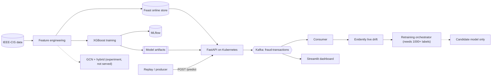

# Architecture

```mermaid
flowchart LR
    DS[("IEEE-CIS data")] --> FE["Feature engineering"]
    FE --> FEAST[("Feast online store")]
    FE --> XGB["XGBoost training"]
    FE -.-> GNN["GCN + hybrid (experiment, not served)"]
    XGB --> MLF[("MLflow")]
    XGB --> MODEL[["Model artifacts"]]
    PROD["Replay / producer"] -->|POST /predict| API["FastAPI on Kubernetes"]
    FEAST --> API
    MODEL --> API
    API --> KAFKA{{"Kafka: fraud-transactions"}}
    KAFKA --> CONS["Consumer"]
    KAFKA --> DASH["Streamlit dashboard"]
    CONS --> DRIFT["Evidently live drift"]
    DRIFT --> ORCH["Retraining orchestrator (needs 1000+ labels)"]
    ORCH -.-> CAND["Candidate model only"]
```

GNN and hybrid are offline experiments. The blend did not beat tuned XGBoost, so only XGBoost is served.
